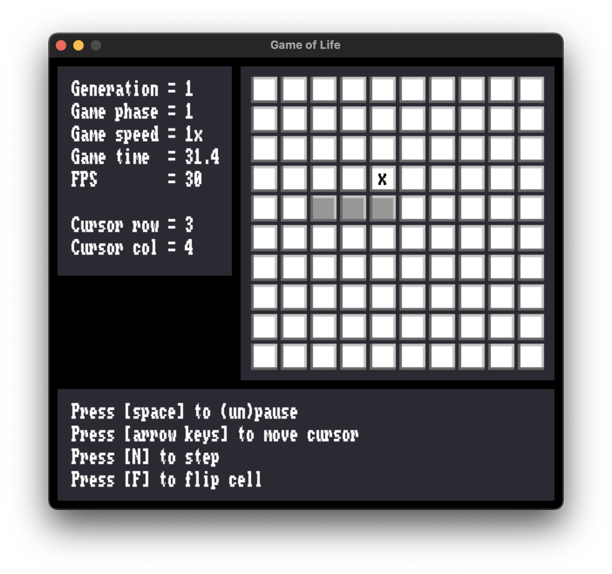
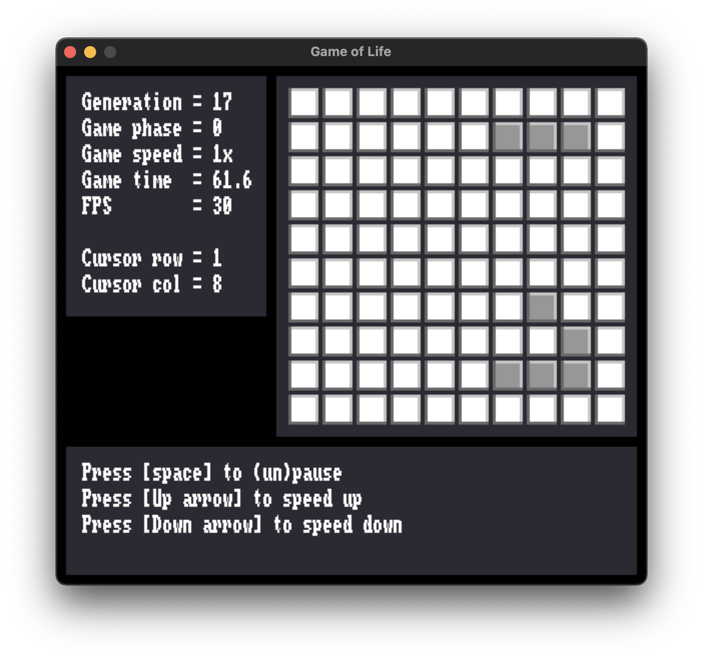

# Game of Life

C implementation of the simple game of life. It was written as an exercise (and for fun). My goals were to explore modern C and to learn the basics of clean C code. 

## Building

Building the game requires C99, `cmake`, and [SDL](https://www.libsdl.org/) (both SDL2 and SDL2_ttf).

```bash
$ cd build
$ cmake -DCMAKE_BUILD_TYPE=Release ..
$ make
```

You may use `-DCMAKE_BUILD_TYPE=Debug` instead if you want to print debug information. 

## Running Life

After building the program, you can run the game of life using:

```bash
$ ./life
```

You can choose the number of rows `n_rows` and the number of columns `n_cols` the game generated when starting the program using:

```bash
$ ./life <n_rows> <n_cols>
```

## Gameplay

Use <kbd>Space</kbd> to (un)pause the simulation.

When editing the board:
- Use keyboard inputs <kbd>&uarr;</kbd>, <kbd>&darr;</kbd>, <kbd>&larr;</kbd>, <kbd>&rarr;</kbd> to move the cursor;
- Use <kbd>N</kbd> to advance to the next generation;
- Use <kbd>F</kbd> to flip the state of a cell.

When playing the simulation:
- Use <kbd>&uarr;</kbd>, <kbd>&darr;</kbd> to increase (respectively decrease) simulation speed. 

|                     Board Edition                      |                        Simulation                         |
|:------------------------------------------------------:|:---------------------------------------------------------:|
|  |  |
